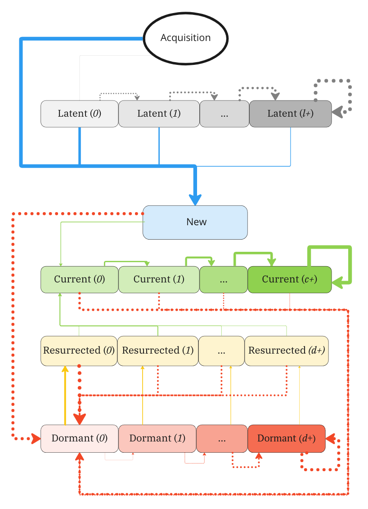

# Intro

I was recently pointed out this [nice article from Duolingo's blog](https://blog.duolingo.com/growth-model-duolingo/), 
which describes the strategy used by this company in the last few years to grow 
their daily active user base. Stripped of any rhetoric, Duolingo's analysts 
employed a simple mathematical framework to model the time evolution of 
Daily Active Users (DAUs), and found out that optimizing a particular type of 
retention rate (CURR - more on this below) had the highest potential impact on 
DAUs.

The mathematical model used by Duolingo is, in its essence, a [compartmental model](https://en.wikipedia.org/wiki/Compartmental_models_in_epidemiology), such
as the ones used for modeling the spread of epidemics. It is actually a *linear* 
compartmental model^[I made up the terminology. By this, I mean that the 
evolution equations of the state vector are linear, for instance 
$\mathbb E (X(t+1)) = A \cdot \mathbb E (X(t))$ for some constant matrix $A$.]
with a relatively simple structure, which allows to derive analytically a bunch 
of useful properties of these models.

In this post I will explore some mathematical properties of such 
*User Lifecycle Models*^[Another term I just made up.], which also allow to shed
some light on Duolingo's result.

# The Duolingo Growth Model

Duolingo's model is illustrated in the picture below. According to this 
schematization, the user base is split into different activity states, and the 
transitions between categories are governed by retention and resurrection rates.

I will not get into the definitions of the various states of this model
(you can find all details in [the original article](https://blog.duolingo.com/growth-model-duolingo/)), but I want to 
point out that main learning Duolingo's analysts got from this research: 
the retention rate of current users - users
that have been active consistently for a certain amount of time - 
had the largest long-term impact on the active user base.

This was clearly a precious insights for Duolingo, as it allowed to focus
on the most relevant product areas to drive growth. In the rest of this post, I
want to investigate a bit more whether this is a general result and ...

)](fig1_growth_model_diagram.png)

# Generalizations

At each time step (a day, a week, or whatever you got), users are decomposed 
into the following activity states:

- *Latent Users* $L_i(t)$. Users who have never been active (failed to activate).
- *New* $N(t)$. Users who are active for the first time this week.
- *Current* $C_i(t)$. Users who are active this week, and were also active during
the previous one.
- *Resurrected* $R_i(t)$. Users who are active this week, but were inactive during the
previous one.
- *Dormant* $D_i(t)$. Users who are inactive during this week.

Moreover, all states but *New* are labeled with a number ($0,\,1,\,\dots$) 
which corresponds to the number of weeks they have remained in the same state - 
which is supposed to give a partial account of how transition probabilities 
depend on previous history.

The evolution of a population is described by the following stochastic 
equations:

$$
\begin{split}
L_0(t+1) & = \nu(t+1) - \Phi_{N\leftarrow\nu}(t+1),\\
L_{i+1}(t+1) & = L_i(t)- \Phi_{N \leftarrow L_i}(t+1),\\
N(t+1) & = \Phi_{N\leftarrow\nu}(t+1)+\sum _{i} \Phi_{N \leftarrow L_i}(t+1),\\
C_0(t+1) & = \Phi_{C_{0} \leftarrow N}(t+1)+ \sum _{i} \Phi_{C_{0} \leftarrow R_i}(t+1),\\
C_{i+1}(t+1) & = \sum _{i} \Phi_{C_{i+1} \leftarrow C_i}(t+1),\\

R_i(t+1) & = \Phi _ {R_{i} \leftarrow D_i}(t+1),\\
D_0(t+1) & = N(t)- \Phi_{_{0} \leftarrow N}(t+1)+\sum_{i}(R_i(t)-\Phi_{C_{0} \leftarrow R_i}(t+1))+\sum_{i}(C_i(t)-\Phi_{C_{i+1} \leftarrow C_i}(t+1)),\\
D_{i+1}(t+1) & = D_i(t)-\Phi_{R_i\leftarrow D_i}(t+1),\\
\end{split},\\
$$
where:

$$
\Phi _{Y \leftarrow X}(t+1) \sim \text{Binom}(X(t),p_{Y \leftarrow X})
$$

